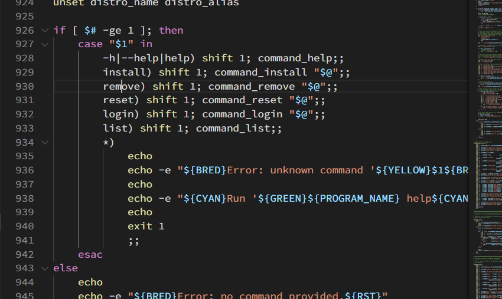
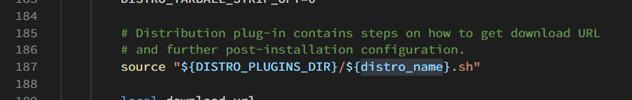
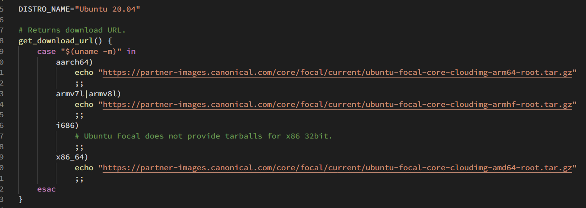

A Bash script for managing proot'ed Linux distributions in Termux.

# What's that?
This forked repo will tell you how to make your own system installer, even if I still don't know all codes. Don't worry, I am not an economist, but it will not affect my business.

# Learn to Fly
- The install.sh in root directory maybe to install proot-distro in your phone.

- proot-distro.sh

  

  

  Look these two pics and you will find the key codes, the app run shell file in ./distro-plugins to download system file. and **the shell file's name (without ext name) is the option to run your command** , for example, I have a file named "debian123.sh" in ./distro-plugins, so my command is `proot-distro install debian123`

- Let's go to ./distro-plugins, open one file you like

  

  The question is the downloading url of your system. I tell you, go "https://github.com/EXALAB/Anlinux-Resources/tree/master/Rootfs" and replace the url.
  
  You can also use Linux Deploy's repos: https://github.com/istomyang/Linux-Deploy-Respository/releases

# References

> https://github.com/termux/proot-distro
> https://wiki.termux.com/wiki/PRoot
> https://wiki.termux.com/wiki/Debian
